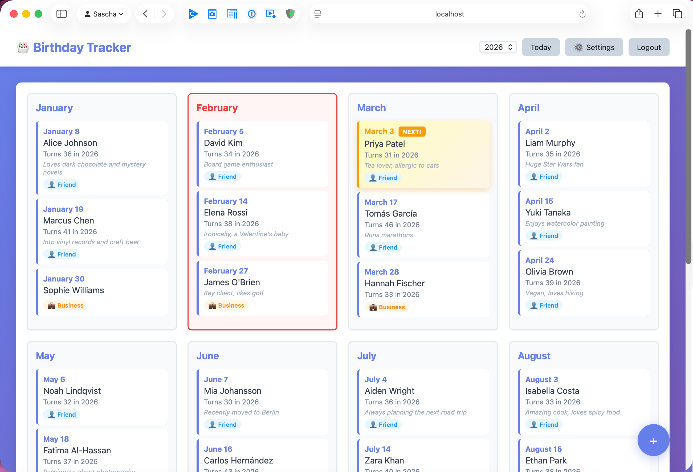
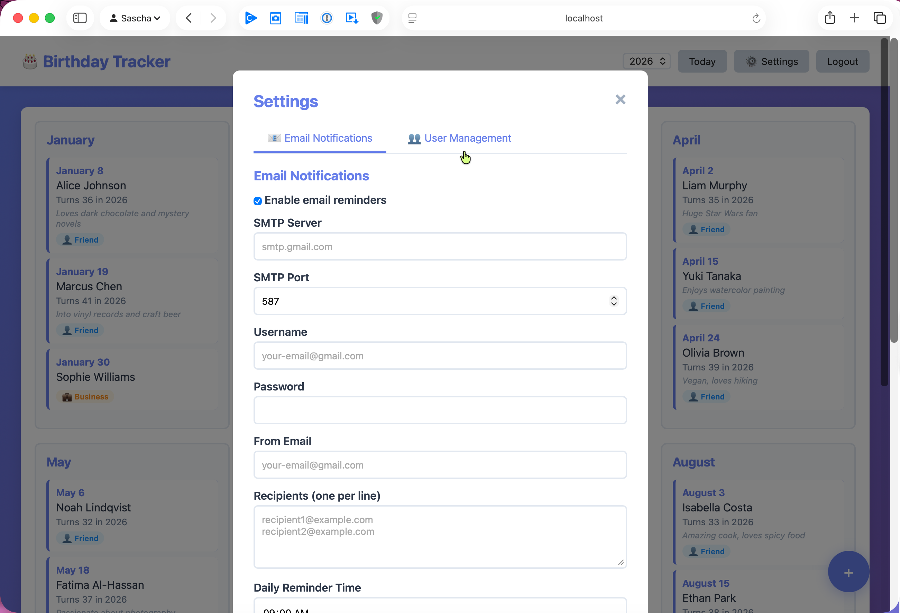
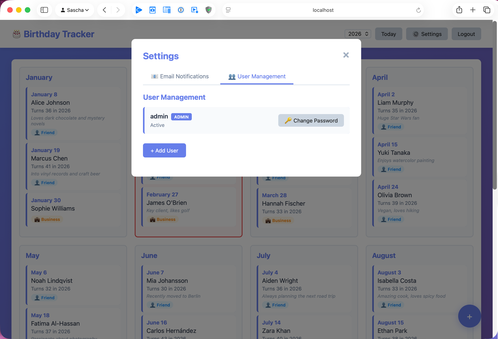

# AI Birthday Calendar / Tracker

A self-hosted birthday tracker with AI-powered gift suggestions and personalized messages. Built with FastAPI, vanilla JavaScript, and OpenAI GPT-4o. Features automated email reminders, user management, and a responsive calendar UI.








## Features

- **Yearly Calendar View** - See all birthdays organized by month
- **CRUD Operations** - Create, read, update, and delete birthdays
- **Email Reminders** - Automated daily reminders sent 1 day before birthdays
- **AI-Powered Suggestions** - Optional OpenAI-generated congratulations messages and gift ideas
- **User Authentication** - Secure login with JWT tokens
- **Responsive Design** - Works on mobile and desktop browsers
- **Configurable Settings** - SMTP settings and reminder time configuration via web UI
- **Contact Categorization** - Organize contacts as Friend or Business
- **Self-Hosted & Privacy-Focused** - Your data stays on your server, no database required

## Tech Stack

- **Backend:** FastAPI (Python 3.10+)
- **Frontend:** Vanilla JavaScript, HTML5, CSS3
- **Storage:** JSON files (no database required)
- **Authentication:** JWT tokens with bcrypt password hashing
- **Scheduling:** APScheduler for automated email reminders
- **Email:** SMTP (Gmail compatible)
- **AI:** OpenAI GPT-4o (optional)

## Installation

### Quick Start (uv)

```bash
# Clone the repository
git clone https://github.com/TechPreacher/ai-birthday-calendar.git
cd ai-birthday-calendar

# Install dependencies
uv sync

# Configure environment
cp .env.example .env
# Edit .env with your settings (see Configuration below)

# Run the application
uv run uvicorn app.main:app --host 0.0.0.0 --port 8081
```

<details>
<summary>Alternative: pip</summary>

```bash
python3 -m venv .venv
source .venv/bin/activate
pip install .
uvicorn app.main:app --host 0.0.0.0 --port 8081
```

</details>

The app will be available at **<http://localhost:8081>**.

### Running as a Systemd Service (Linux)

Before installing, edit `birthdays.service` and replace `YOUR_USER` with the user account that should run the service. Also update the paths if you installed to a directory other than `/opt/birthdays`.

```bash
sudo cp birthdays.service /etc/systemd/system/
sudo systemctl daemon-reload
sudo systemctl enable birthdays
sudo systemctl start birthdays

# Check status
sudo systemctl status birthdays
```

## Default Credentials

- **Username:** `admin`
- **Password:** `changeme`

**IMPORTANT:** Change the admin password immediately after first login!

## Configuration

### Environment Variables

Create a `.env` file (or copy from `.env.example`):

```bash
BIRTHDAYS_DATA_DIR=./data
BIRTHDAYS_SECRET_KEY=change-this-to-a-random-secret-key
BIRTHDAYS_ADMIN_USERNAME=admin
BIRTHDAYS_ADMIN_PASSWORD=changeme
```

After changing credentials, restart the application.

### Email Notifications

Configure email settings through the web UI:

1. Log in as admin
2. Click **Settings** (gear icon)
3. Enable email notifications
4. Enter SMTP server details:
   - **SMTP Server** - e.g., `smtp.gmail.com`
   - **SMTP Port** - Usually `587` (TLS) or `465` (SSL)
   - **Username** - Your email address
   - **Password** - Your email password or app-specific password
   - **From Email** - The sender address
   - **Recipients** - One email per line
   - **Reminder Time** - Time to send daily reminders (default: 09:00)

**Gmail Users:** You'll need to use an [App Password](https://support.google.com/accounts/answer/185833) instead of your regular password.

**Test Mode:** Enable this to log emails without actually sending them (useful for testing).

### AI Features (Optional)

The app can enhance birthday reminder emails with AI-generated personalized congratulations messages and gift suggestions using OpenAI's GPT-4o model.

#### How It Works

When AI features are enabled, each birthday reminder email includes:

- A warm, personalized congratulations message tailored to the person
- 5 gift suggestions based on their name, age, and any notes you've added

**Example email:**

```
Subject: Birthday Reminder - 2 birthday(s) tomorrow

Birthday Reminder for April 10, 2026

The following people have birthdays tomorrow:

- Jane Doe (turning 30)

  Happy birthday to Jane! Turning 30 is a wonderful milestone...

  Gift Ideas:
  - A premium bottle of wine or craft beer selection
  - A high-quality leather wallet or watch
  - Tickets to a concert or sporting event
  - A personalized photo book or custom artwork
  - An experience gift like a cooking class or spa day
```

#### Setup

1. Get an API key from [OpenAI](https://platform.openai.com/api-keys)
2. In the app, go to **Settings > Email Notifications**
3. Scroll to **AI Features**
4. Check **"Enable AI-generated gift ideas and messages"**
5. Paste your OpenAI API key
6. Click **Save Settings**

**Cost:** Approximately $0.02-$0.04 per birthday using GPT-4o. For 50 birthdays per year, that's roughly $1-2/year.

#### Privacy

- Only birthday information (name, age, notes) is sent to OpenAI
- No email addresses or other personal data is shared
- If the AI call fails, the email is still sent without AI content

To disable AI features at any time, uncheck the option in Settings.

## Usage

### Adding a Birthday

1. Click the **+ Add Birthday** button (bottom right)
2. Enter the name, birth date, and optional birth year
3. Add an optional note (e.g., "Best friend", "Loves gardening")
4. Click **Save**

### Editing a Birthday

1. Click on any birthday in the calendar
2. Modify the details
3. Click **Save** or **Delete**

### Viewing Different Years

Use the year selector in the top navigation to see ages people will turn in different years.

## How Email Reminders Work

- The scheduler checks daily at the configured time (default: 09:00)
- It finds all birthdays happening **tomorrow**
- Sends a single email to all configured recipients
- Includes names, ages (if birth year is known), and notes
- Optionally includes AI-generated messages and gift ideas

## Data Storage

All data is stored as JSON files in your configured data directory:

- `birthdays.json` - Birthday entries
- `users.json` - User accounts and password hashes
- `settings.json` - Email and AI settings

**Backup recommendation:** Regularly back up your data directory.

## API Documentation

Interactive API documentation is available at `/docs` (Swagger UI) when the app is running.

## Project Structure

```
ai-birthday-calendar/
├── app/
│   ├── __init__.py
│   ├── main.py           # FastAPI app entry point
│   ├── auth.py           # Authentication logic
│   ├── models.py         # Data models (Pydantic)
│   ├── storage.py        # JSON storage layer
│   ├── scheduler.py      # Email reminder scheduler
│   ├── config.py         # Configuration
│   ├── routes/
│   │   ├── __init__.py
│   │   ├── auth.py       # Auth endpoints
│   │   ├── birthdays.py  # Birthday CRUD endpoints
│   │   └── settings.py   # Settings endpoints
│   └── static/
│       ├── index.html    # Main UI
│       ├── css/
│       │   └── styles.css
│       └── js/
│           └── app.js    # Frontend logic
├── data/                 # JSON data files (created at runtime)
├── tests/                # Test suite
├── pyproject.toml        # Python dependencies
├── uv.lock               # Dependency lock file
├── birthdays.service     # Systemd service file
├── install.sh            # Installation helper script
└── .env.example          # Environment variable template
```

## Troubleshooting

### Check Service Status

```bash
sudo systemctl status birthdays
```

### View Logs

```bash
sudo journalctl -u birthdays -f
```

### Restart the Service

```bash
sudo systemctl restart birthdays
```

### Email Not Sending

1. Check your SMTP credentials in Settings
2. Enable **Test Mode** and check logs for error messages
3. For Gmail, ensure you're using an App Password
4. Check that firewall rules allow outbound SMTP connections

### AI Suggestions Not Appearing

1. Verify AI is enabled in Settings
2. Check that the OpenAI API key is entered correctly (starts with `sk-...`)
3. Ensure your OpenAI account has available credits
4. Check logs for API errors

## Security Notes

- Change the default admin password immediately after setup
- Set `BIRTHDAYS_SECRET_KEY` to a long random string
- Passwords are hashed with bcrypt
- Consider running behind a reverse proxy (Nginx/Caddy) with HTTPS for production use
- The OpenAI API key is stored in `data/settings.json` -- restrict file permissions accordingly

## License

MIT License
